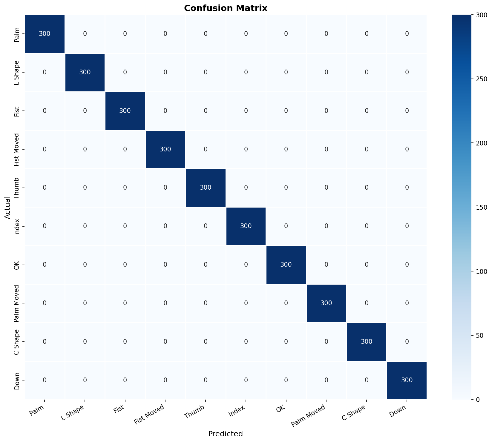
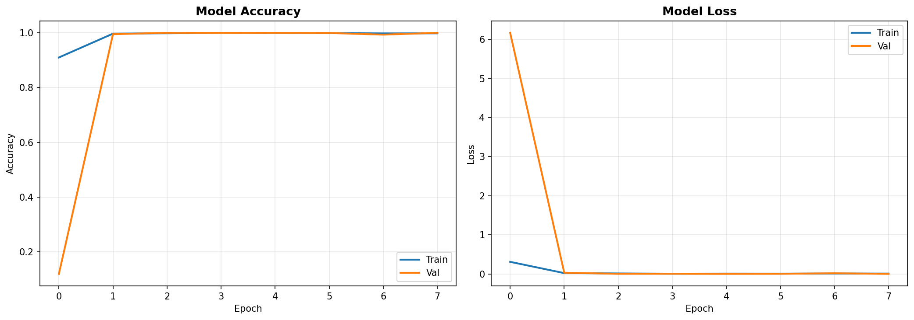
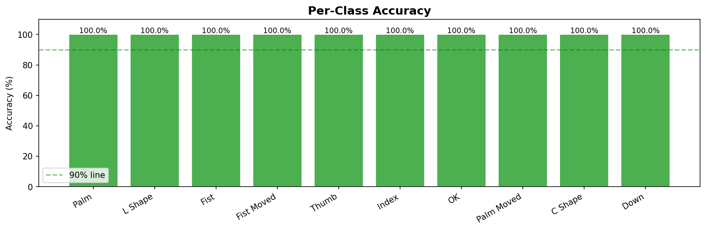
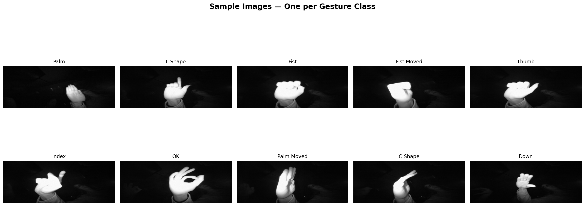

# 🤚 Hand Gesture Recognition — SkillCraft Technology Internship Task 04


## 📌 Objective
Develop a hand gesture recognition model that can accurately identify and classify different hand gestures from image data, enabling intuitive human-computer interaction and gesture-based control systems.

---

## 📂 Dataset
**LeapGestRecog** — Leap Motion Infrared Hand Gesture Dataset

> ⚠️ Dataset not included in this repository due to large size (~1.4 GB).  
> 📥 Download it here: [LeapGestRecog on Kaggle](https://www.kaggle.com/datasets/gti-upm/leapgestrecog)

**Structure after downloading:**
```
leapGestRecog/
├── 00/  (Subject 1)
│   ├── 01_palm/        → 200 images
│   ├── 02_l/           → 200 images
│   ├── 03_fist/        → 200 images
│   ├── 04_fist_moved/  → 200 images
│   ├── 05_thumb/       → 200 images
│   ├── 06_index/       → 200 images
│   ├── 07_ok/          → 200 images
│   ├── 08_palm_moved/  → 200 images
│   ├── 09_c/           → 200 images
│   └── 10_down/        → 200 images
├── 01/ ... 09/  (Subjects 2–10)
```

| Property | Value |
|----------|-------|
| Total Images | 20,000 |
| Subjects | 10 |
| Gesture Classes | 10 |
| Images per Class | 2,000 |
| Image Type | Infrared (Grayscale) |
| Original Resolution | 640 × 240 px |

---

## 🤌 Gesture Classes

| Label | Gesture |
|-------|---------|
| 01_palm | Palm |
| 02_l | L Shape |
| 03_fist | Fist |
| 04_fist_moved | Fist Moved |
| 05_thumb | Thumb |
| 06_index | Index Finger |
| 07_ok | OK Sign |
| 08_palm_moved | Palm Moved |
| 09_c | C Shape |
| 10_down | Down |

---

## 🧠 Approach

### Why CNN over MediaPipe?
The dataset uses **Leap Motion infrared images** — high contrast, black background, near-white hand. MediaPipe was trained on standard RGB camera images and failed to detect hands in ~65% of these infrared images. A **CNN trained directly on pixels** is the correct approach for this dataset.

### Model Architecture
A custom **3-block Convolutional Neural Network**:

```
Input (128×128×1 Grayscale)
    ↓
Conv Block 1: Conv2D(32) → BN → Conv2D(32) → MaxPool → Dropout(0.25)
    ↓
Conv Block 2: Conv2D(64) → BN → Conv2D(64) → MaxPool → Dropout(0.25)
    ↓
Conv Block 3: Conv2D(128) → BN → Conv2D(128) → MaxPool → Dropout(0.25)
    ↓
Flatten → Dense(256) → BN → Dropout(0.5)
    ↓
Output: Dense(10, softmax)
```

### Training Strategy
| Parameter | Value |
|-----------|-------|
| Image Size | 128 × 128 (grayscale) |
| Batch Size | 32 |
| Optimizer | Adam (lr=0.001) |
| Loss | Categorical Crossentropy |
| Train/Val/Test Split | 70% / 15% / 15% |
| EarlyStopping | patience=5, monitor=val_accuracy |
| ReduceLROnPlateau | factor=0.5, patience=3 |

---

## 📊 Results

| Metric | Value |
|--------|-------|
| **Test Accuracy** | **100%** |
| **Test Loss** | **0.0024** |
| Training stopped at | Epoch 8 (EarlyStopping) |
| Best val_accuracy | 100% (Epoch 3) |

### Confusion Matrix


### Training Curves


### Per-Class Accuracy


### Sample Gestures


---

## 🚀 How to Run

**1. Clone the repository**
```bash
git clone https://github.com/jarv153/SCT_ML_4.git
cd SCT_ML_4
```

**2. Install dependencies**
```bash
pip install -r requirements.txt
```

**3. Download the dataset**
- Download from [Kaggle](https://www.kaggle.com/datasets/gti-upm/leapgestrecog)
- Place the `leapGestRecog` folder in the same directory as the notebook

**4. Update the dataset path**

In `hand_gesture_recognition.ipynb`, Step 2, update:
```python
DATASET_PATH = r'path\to\your\leapGestRecog'
```

**5. Run the notebook**
```bash
jupyter notebook hand_gesture_recognition.ipynb
```
Run all cells top to bottom. Training takes ~45–60 mins on CPU.

---

## 📁 Repository Structure
```
SCT_ML_4/
├── hand_gesture_recognition.ipynb   # Main notebook
├── best_gesture_model.keras         # Trained model
├── requirements.txt                 # Dependencies
├── README.md                        # This file
├── confusion_matrix.png             # Evaluation chart
├── training_curves.png              # Training history
├── per_class_accuracy.png           # Per-class breakdown
├── class_distribution.png          # Dataset distribution
└── sample_gestures.png             # Sample images
```

---

## 🛠️ Tech Stack
- **Python 3.13**
- **TensorFlow 2.21 + tf_keras**
- **OpenCV** — image loading & preprocessing
- **Scikit-learn** — train/test split, metrics
- **Matplotlib & Seaborn** — visualizations
- **NumPy & Pandas** — data handling

---

## 👤 Author
**Jatin**  
Machine Learning Intern — SkillCraft Technology  
Task 04 — Hand Gesture Recognition

---

## 📄 License
This project is for educational and internship purposes.

> ⚠️ best_gesture_model.keras not included. Run the notebook to generate it locally.
